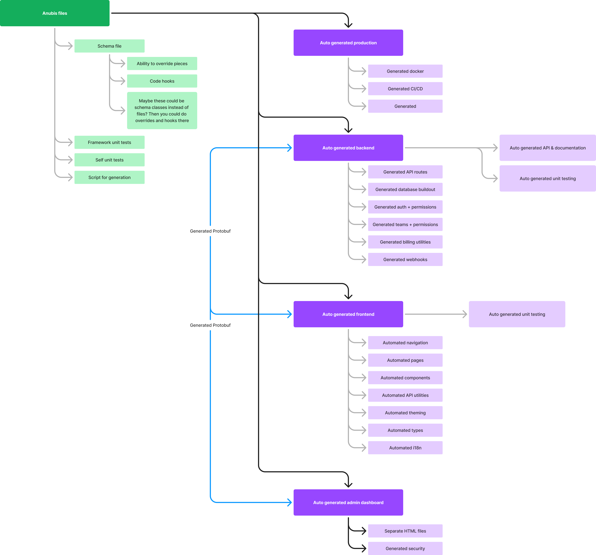
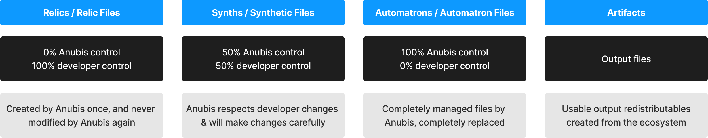
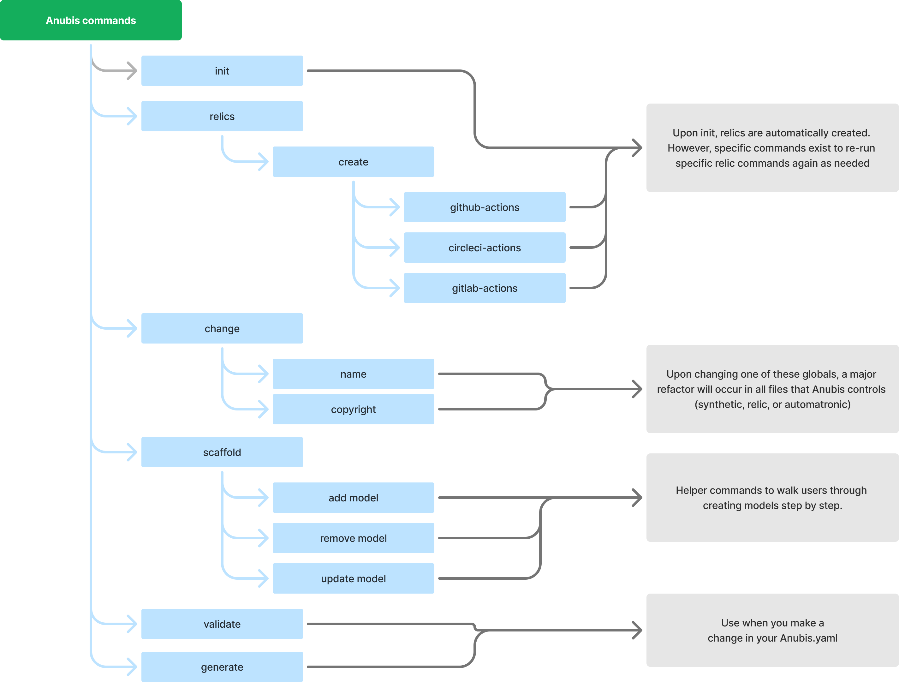

# The Anubis Framework
A project by [NavarroTech](https://www.navarrotech.net/)

**THIS PROJECT IS IN DEVELOPMENT/ALPHA, AND IS CURRENTLY UNSTABLE.**
**NO RELEASES HAVE BEEN PUBLISHED YET.**

Anubis is a cutting-edge framework designed to revolutionize the way you build full-scale SaaS web applications. Drawing inspiration from the efficiency and flexibility of [Bullet Train](https://bullettrain.co/), Anubis leverages the power of Rust for the backend and Preact for the frontend to deliver a highly automated and customizable development experience. With Anubis, you can generate 90% of your application's codebase in just 15 minutes using a powerful CLI and a single schema file.

Anubis provides a robust infrastructure that includes autogenerated production code, Docker configurations, CI/CD pipelines, API routes, unit tests, authentication, permissions, billing utilities, and much more.

Whether you're starting a new project or enhancing an existing one, Anubis empowers you to focus on the unique aspects of your application while handling the repetitive tasks with ease and precision. Embrace the future of SaaS development with Anubis and build powerful applications faster than ever before.

## The goal of the Anubis Framework
The goal is that I should be able to build 80% -> 90% of a full scale SaaS web application in 15 minutes with just a CLI and no code editor.

**For example**, if I was making a bank app and wanted to add transactions, I could use the CLI to create a database table "transactions", and in that CLI command I could define each column and constraints. That would then create the object data model in the schema, and auto generated the rust CRUD api routes with validators and internationalized error messages, auto setup the ORM connections, automatically create unit tests for those routes, then create admin dashboard tools to view/manage that data, automatically create protobuf interfaces, automatically create the frontend forms, views, and add a "transactions" page to a sidebar. Automatically create unit tests for the frontend views, automatically pagination lists of transactions, automatically create redux reducers for the transactions, etc. **I should be able to do all of this from the CLI, without opening a code editor.**

## Anubis Terminology

**Synths / Synthetic Files**

  These are files that are partially auto-generated but allow for a user to modify it and persist the changes amongst auto-generated changes.
  You can think of synthetics like files that you and anubis write together. They still may change from the schema changes to anubis, but anubis will always honor your changes.
  These are the least stable of files, as a change to the schema may require you to double check yoru synthetic files.
  For example, Dockerfiles are Synthetics

**Automatrons / Automatron Files**

  These are files that are 100% controlled by the Anubis framework. It is dangerous to make changes to these files directly.
  All changes you may make to these files WILL be wiped when the schema regenerates.
  For example, documentation and most proto schemas are Automatrons

**Relics / Relic Files**

  These are files that are only created upon creating a new project, and Anubis will not update them further.
  These are the safest files for you to edit, as your changes will be guaranteed to always stay.
  For example, CI/CD pipelines are Relics

**Artifacts**

  These are the most traditional to the actual term "artifacts" that are outputs to the whole system.
  For example, output production docker images & output production HTML/CSS are artifacts.

## Available commands

## How does it work?
Anubis uses a core anubis.yaml file that lives in the root of your project, that will determine everything. You can either edit the schema directly or use the CLI for step-by-step building.

As you build the schema, Anubis will do all of the heavy lifting for you.

## Anubis tech stack
This is the technology that Anubis will setup for you and auto-generate.
In it's current state, Anubis cannot offer other options. 
In the future, we'd love to include support for different CSS, data shapes, websocket frameworks, and database choices.
If you want these swappable sooner, hit that pull request button ;)

Backend language - [Rust](https://www.rust-lang.org/)
Backend API framework - [Rocket](https://rocket.rs/)
Database - [PostgreSQL](https://www.postgresql.org/)
Websockets - [Socket.io](https://socket.io/) & [Rust Socket.io](https://github.com/1c3t3a/rust-socketio)
Data shapes - [Protobuf]() and optional JSON API
Internationalization - [i18next](https://www.i18next.com/)
Frontend - [Preact.js](https://preactjs.com/), compiled with [Vite](https://vitejs.dev/)
Frontend unit tests - [Vitest](https://vitest.dev/)
Frontend state - [Spiccato](https://www.npmjs.com/package/spiccato) by qdizon
Frontend css - [Tailwinds CSS](https://tailwindcss.com/)

## What about custom features?
Let's say I want to put a Leaflet/Mapbox map into the software, or maybe I'm building a dating app and have very untraditional UI for swiping left/right. 

The schema allows for overriding methods, using custom written views, and is plugin-based so new views could be added for everyone as addons. When overriding a method or adding a custom view, the Anubis Framework will give you many tools, types, and utilities to focus on making a great product with powerful tools at your fingertips.

## Contributing
Instructions on contributing will be written in the future. For now, please just use the Github issues to report issues, and submit pull requests with suggested code revisions.

## Authors
Creator [Alex Navarro](https://github.com/navarrotech/)
